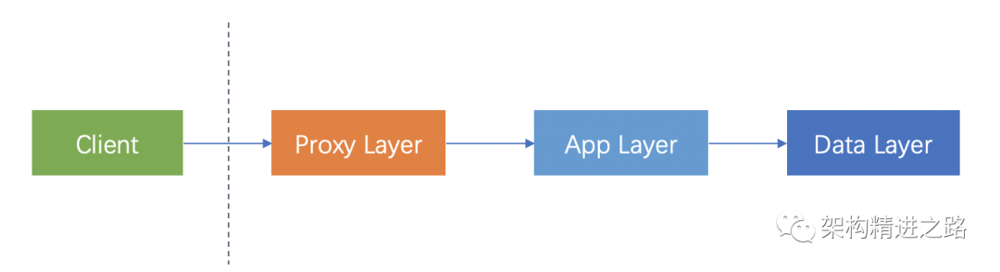
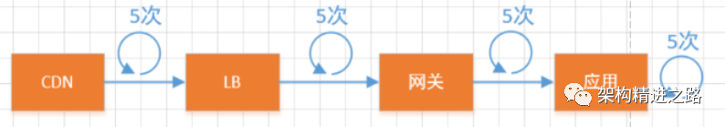

# 故障设计

## 1. 简介

通常情况下，我们的一个请求会经过三个服务来处理。

请求从客户端发出，到达Proxy Layer（执行一些公共的逻辑，如逻辑、流控、审计等），完成后，发往App Layer（执行具体业务逻辑），执行完毕后，发向Data Laye（进行数据持久化）。

事情看起来很简单，然而，在一个分布式系统中：`出错是常态`。
因此，我们需要：`Design For Failure`。即当你的系统将错误当作正常流时，系统便已经对错误免疫了。
在此，跟大家介绍常见的12种设计思想。

## 2. 设计思想

### 2.1. 防御性设计(Defensive Design)

所谓的防御性设计实际上就是“防呆”，英文叫Idiot Proofing。说白了就是用户有时候会不自觉的做一些蠢事，我们在设计的时候要尽量考虑到一些不规范的交互行为，如果你的用户是一只猴子，你要写包单保证系统不被玩坏。

> 注：防御性设计是一种设计思想，它的目的是为了防止用户在系统中做出错误的行为。
> 例如，在Android开发中使用到的Monkey Test就是用于这样的目的。

### 2.2. 边界情况(Edge Case)

这个设计思想在测试领域比较常见，就是我们在设计我们的设计案例的时候有没有充分考虑在边界情况下的系统行为。

> 例如：在设计一个系统的时候，我们需要考虑到系统的边界情况，比如：系统的边界情况是用户输入的数据是否合法，或者是系统的边界情况是用户输入的数据是否合法。
> 比较常见的例如，闰年情况、跨日情况等边界。

### 2.3. 防误措施(Mistake Proofing)

怎么保证不会发生错误。例如在人机交互环节，能不能进行输入校验？

### 2.4. 解耦(Decoupling)

设计的时候，哪怕是最基础的代码也应该符合开闭原则。
Spring的`IOC`就是为了把对象创建及维护从原来的由引用类负责这种强耦合模式转成通过spring容器负责。且解耦一般的做法是通过把内部逻辑封装起来，暴露对外统一API接口，调用方不需要了解被调用方的内部逻辑实现，只需要知道提供什么功能即可。

> 再引申一下，解耦的作用就在于复用，把所有的高内聚功能独立成一个个模块，然后就可以像乐高积木一样根据调用方的实际需求进行组装。

### 2.5. 冗余(Redundancy)

所谓的冗余指的通过重复配置关键组件或部件，保证在关键组件失效的情况下还有备份组件运作以便保证系统可以继续提供服务。生活中的例子请参与飞机的双引擎设计。
主从模式就是冗余的体现。在正常情况下，主实例负责提供全部的服务，从实例在主实例整体或部分不可用的情况下，完全替代主实例整体或局部而对外提供服务。

### 2.6. 重试(Retry)

重试是在分布式系统下处理瞬态故障的一个基本手段，简单有效（当然重试的前提是要求幂等）。但是重试也是可以很危险的，它能够引起把一个局部小时间迅速升级为一个系统重大故障，严重者导致系统假死。

### 2.7. 冷备(Cold Standby)

冷备实际上也是冗余设计的其中一种体现，只是它会更侧重于“冷”，意思是当系统发生宕机时，这个系统是需要手动启动用于替换下线的主实例，它是跟热备是不一样，热备更多体现在自动切换。

### 2.8. 熔断(Derating)

熔断本质上就是一种防御性设计或者策略。假设一个微服务体系下的系统，其中A服务调用B服务。系统的QPS是千级别，当时如果B服务挂掉的话A的线程绝对在短时间内占满耗尽而导致假死，从而形成大量A请求积压而导致情况恶化，最终形成雪崩。

### 2.9. 容错(Error Tolerance)

狭义的容错泛指人机交互界面的时候需要对用户输入进行输入校验，保证数据准确性。
广义的容错应该是两个具有明确边界的事物（如服务间，系统间）交互时候针对可能发生的一切主客观异常情况的防御性手段。常见的容错机制有failsafe、failback、failover、failfast。

* failfast 更多指的是快速失败，避免线程积压导致系统滚雪球式崩溃。
* failover 指的是失效转移。
* failsafe 指的是失效安全。
* failback 指的是失效自动恢复，将故障实例切换到备实例。

### 2.10. 失效安全(Fail safe)

所谓的失效安全，就是指在特定失效的情况下，一个系统或者服务也不会对业务造成损害。

> 例如：我们使用token进行安全登录也是一种失效安全的体现，如果token失效了（如时间过期），用户是无法登录的，因为正常登录需要token有一种约束因素，这种因素就是时间。如果时间过了，代表这种约束因素不存在或者不再有效了，登录功能就不能正常工作了。

### 2.11. 优雅降级(Graceful Degradation)

服务降级跟熔断还是挺像的，只是降级来得更加温和和优雅一点。熔断是直接断掉防止异常进一步扩大而导致雪崩，但是我们的终极目标是提供尽可能多的服务，这个就是优雅降级的理念。在一些异常情况或者秒杀场景下，为了保证核心服务（如商品下单、支付）的正常可用，会放弃掉一些非核心服务（如历史账单查询），这就是所谓的服务降级。

> 在微服务框架中，一般会使用Hystrix的@HystrixCommand或Feign的@FeignClient对服务进行声明，然后为每个服务配置相应的fallback类，最终结合起来进行服务降级。

### 2.12. 耐用性(Durability)