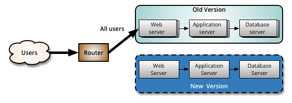
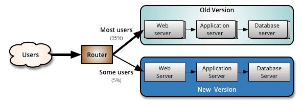
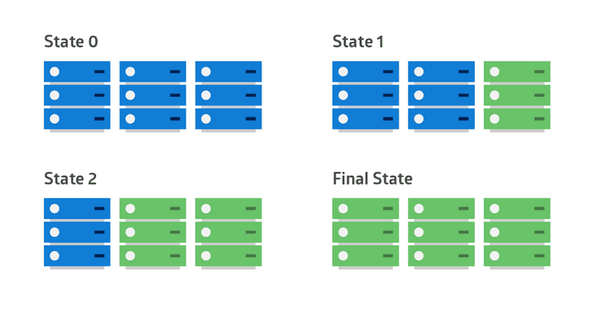

# 灰度发布

借鉴阿里巴巴集团的研发说法：

阿里巴巴集团内部有不少故障是因为发布直接或间接引起。因此提升发布的质量，减少错误的发生，是有效减少线上故障的一个关键环节。

**为什么大部分的故障和发布相关？**

* 因为发布是整个功能更新到线上的最后一个环节，一些研发过程中累计的问题，在最后发布环节才会触发。同
* 时发布本身也是一个复杂的过程，在发布过程中，往往容易出现一些错误操作或者遗漏关键操作。

灰度发布是发布整个过程中一个非常重要的环境。目前灰度发布策略有这几种:

## 1. 蓝绿发布(Blue-Green Deployment)

通过部署两套环境来解决新老版本的发布问题。如果新版本(New Version)发生问题要进行回滚的时候，直接通过切流将流量全部切到老版本(Old Version)上。

* 优点：
  * 升级切换和回退比发布回滚迅速
* 缺点：
  * 成本较高，需要部署两套环境。
  * 如果新版本中基础服务出现问题，会瞬间影响全网用户；
  * 如果新版本有问题也会影响全网用户.

## 2. 金丝雀发布(Canary Release)

* 优点：
  * 灵活，策略自定义，可以按照流量或具体的内容进行灰度(比如不同账号，不同参数)，出现问题不会影响全网用户
* 缺点：
  * 没有覆盖到所有的用户导致出现问题不好排查.

## 3. 滚动发布(Rolling Release)

金丝雀发布的一种变化。通过分批发布的方式进行多批发布(比如一共 9 个实例，分 3 批，每次 3 个实例发布)，适合大规模应用发布

* 优点：
  * 出现问题不会影响全网用户，适合大规模应用发布
* 缺点：
  * 发布和回滚周期较长